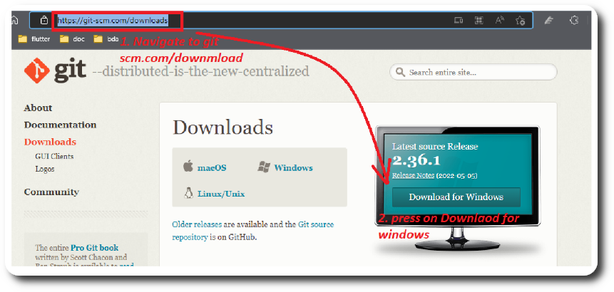
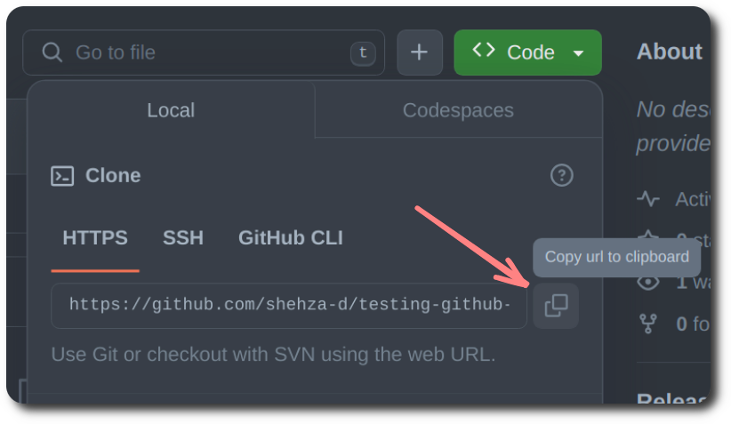
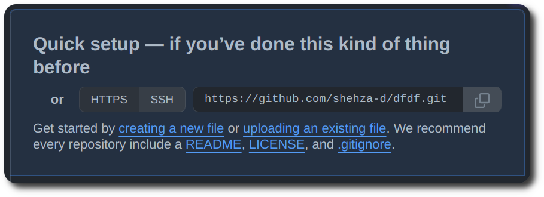

# Git and Github

These are easy to follow steps to push code to github. (for theory of git [visit this page](./README.md))

1. Install Git from the [git-scm.com/downloads](https://git-scm.com/downloads).

   

1. In terminal `git --version` command should return the Git version that is installed on your computer.

1. Type this in terminal with your credentials.

   ```bash
   git config --global user.name "Shehzad Iqbal"

   git config --global user.email "shehzaddiqbal@gmail.com"
   ```

1. If you don't have already `Sign up` for an account at [github.com](https://github.com/signup).

   (First 4 steps are only required one time)

1. Create a new repo on github.com simply by clicking the `New` button and giving it a unique name or visit [github.com/new](https://github.com/new).

1. Keep your repo public and leave other options as it is.

1. Copy http link below green `Code` button

   

   OR

   

1. Run this command in new folder

   ```bash
     git clone <paste-link-here>
   ```

1. This command will generate a hidden `.git` folder in your project, where Git stores all internal tracking data for the current repository. We don't need to look and change in .git. **All files next to `.git` folder will be pushed!**

1. Navigate in the Folder with

   ```bash
   cd folderName
   ```

1. Open VS Code with `code .` command and Create a files name `index.html`.

1. Then to add files and push code run these commands in your project.

   ```bash
   git add .
   ```

   ```bash
   git commit -m "my message"
   ```

   ```bash
   git push origin main
   ```

1. Your terminal should look like this

   
   and your code should be next to `.git` folder.

   

1. Add your digital creations to the repository – your code, documents, images, or anything you create and keep evolving!

## Common problems

1. Not giving space in commands like

   ```bash
   git commit-m "my message"
   ```

1. `nothing to commit` error mean your folder with `.git` is either empty or code has already being pushed.

1. `fatal: not a git repository` error comes when you are in folder where git is not initialized i.e there is no `.git` folder.

## [Learning Git Repo by Shehzad](https://github.com/shehza-d/teaching-git)

## [Complete Git Course (Basic to Advance)](https://www.youtube.com/playlist?list=PLKueo-cldy_HjRnPUL4G3pWHS7FREAizF)

<!-- ## Points
- initialize mean setting-up the ground before starting something.
- cli vs gui
- repo
- working directory
- [Multiple Backups](https://git-scm.com/about/distributed) -->
