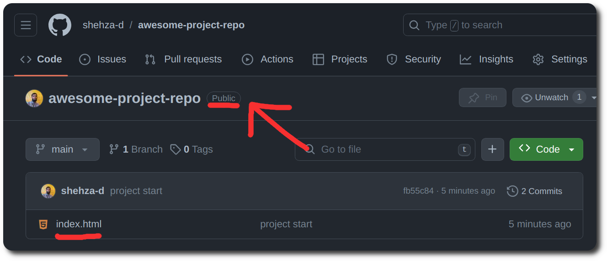
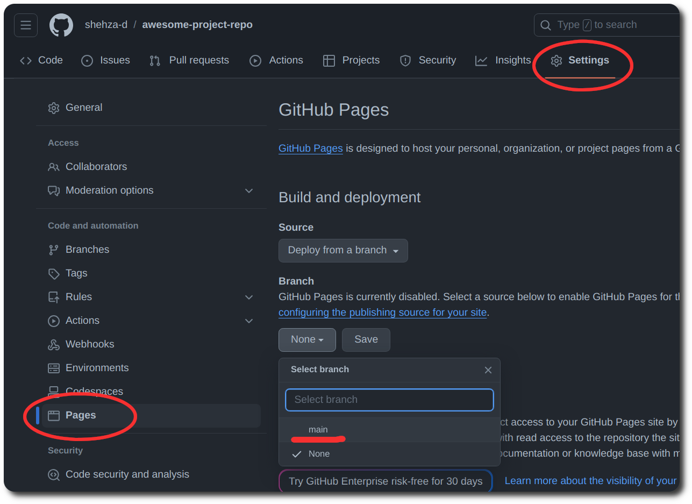

# Hosting on Github Pages

1. First make sure your repo is Public

2. Your repo has index.html file in root of project.

   
   (If you index.html file is in folder or I is capital of Index.html hosting will not be successful)

3. Then go to repo `setting` > `pages` and under branch heading click none and select `main` and don't forget to save.

   

4. Wait for 5 to 10 minutes and refresh the page to get the hosted link.
