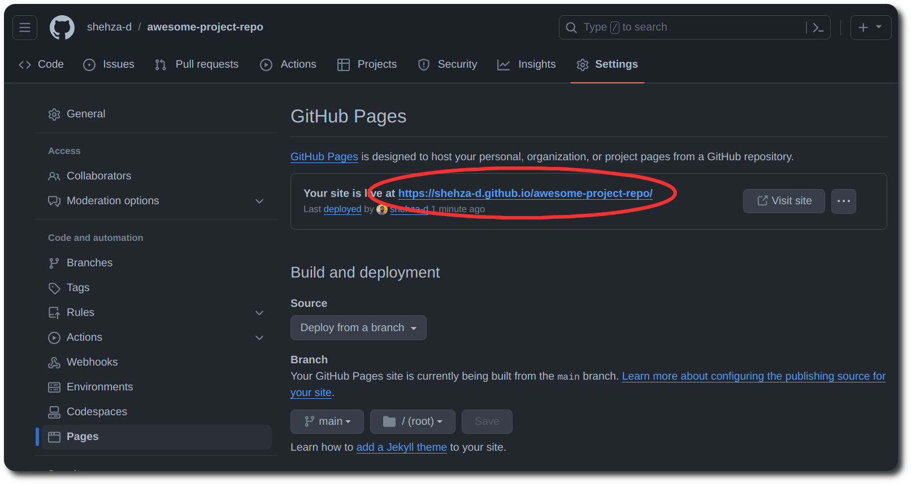
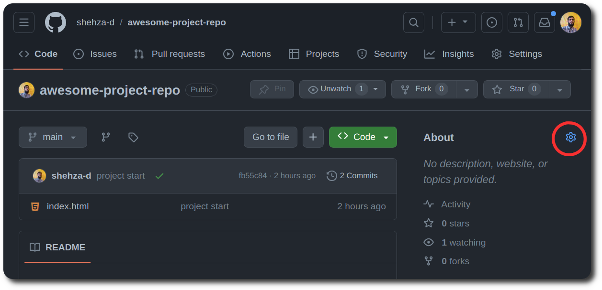
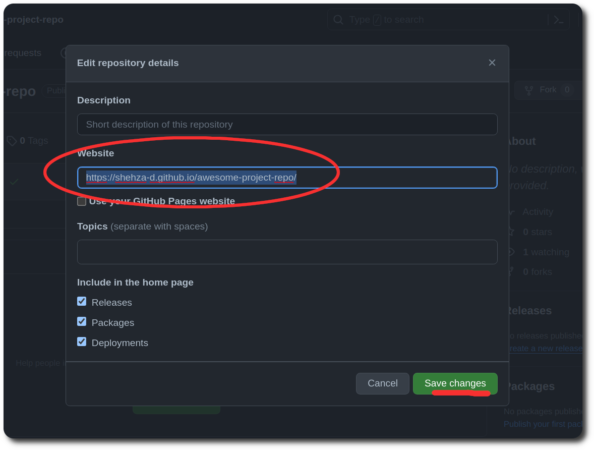

# Hosting on Github Pages

Hosted directly from your GitHub repository. Just edit, push, and your changes are live.

Github pages provide free and unlimited hosting for static html sites.

1. First make sure your repo is Public

1. Your repo has index.html file in root of project.

   
   (If you index.html file is in folder or I is capital of Index.html hosting will not be successful)

1. Then go to repo `setting` > `pages` and under branch heading click none and select `main` and don't forget to save.

   

1. Wait for 5 to 10 minutes and refresh the page to get the hosted link.

   

1. Congratulations! you have hosted your Web page

   You can visit you Web page by clicking the link highlighted in above image.

1. Suggestion: Copy the link and add it to your repos description.

   On home page click in button
   

1. And paste your hosted in in Website input (it's better to add description as well) and click save

   
